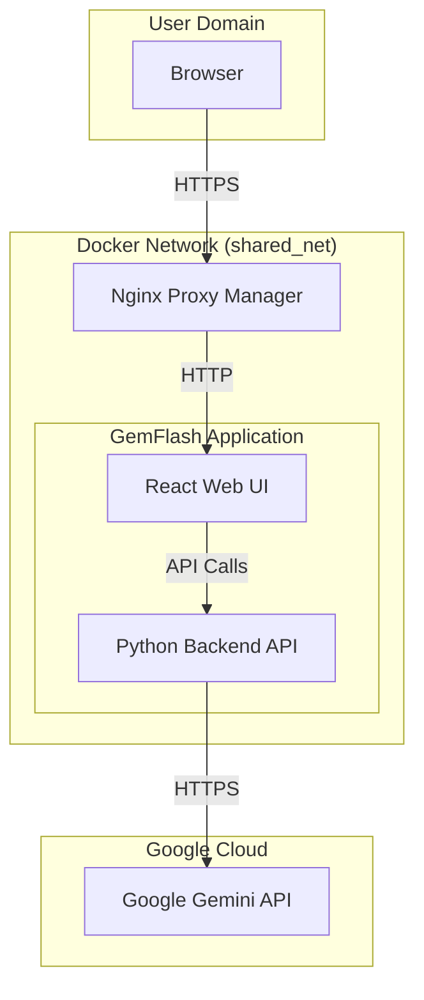

# GemFlash System Architecture

This document provides a high-level overview of the GemFlash system architecture, data flow, and key components. It should be read in conjunction with `CONDUCTOR.md` for security context.

## 1. System Diagram

This diagram illustrates the primary components and their interactions.

## 2. Component Overview

*   **Nginx Proxy Manager**: Acts as a reverse proxy, providing a single entry point to the application and handling SSL termination.
*   **React Web UI**: The frontend of the application, built with React, Tailwind CSS, and shadcn/ui. It provides the user interface for image generation and editing.
*   **Python Backend API**: The backend service that receives requests from the Web UI, interacts with the Google Gemini API, and returns the results.
*   **Google Gemini API**: The external AI service that performs the core image generation and editing tasks.

## 3. Data Flow

1.  The user accesses the GemFlash web application in their browser through the Nginx Proxy Manager.
2.  The React Web UI is loaded. The user interacts with the UI to provide a prompt and/or upload images.
3.  The Web UI sends the data to the Python Backend API.
4.  The Backend API constructs a request with the user's input and the `GOOGLE_API_KEY` and sends it to the Google Gemini API.
5.  The Google Gemini API returns the processed image.
6.  The Backend API sends the image back to the Web UI, which displays it to the user.
7.  The user can then download the image to their local machine.

## 4. Security Boundaries

*   **Docker Network**: The application components run within an isolated Docker network (`shared_net`). Only the Nginx Proxy Manager is exposed to the host.
*   **API Key Secrecy**: The `GOOGLE_API_KEY` is only accessible to the Python Backend API and is never exposed to the frontend or the user.
